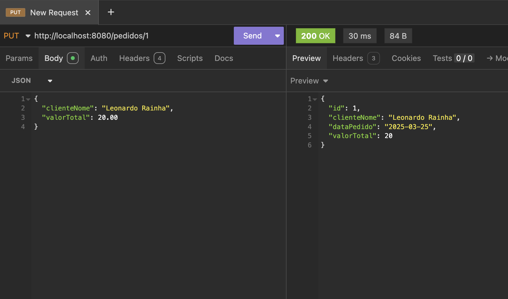

# Checkpoint 1 - API de Pedidos

## Endpoints

1. **GET /pedidos**
    - Retorna todos os pedidos
    - Resposta: Lista de pedidos em JSON

2. **GET /pedidos/{id}**
    - Retorna um pedido específico
    - Exemplo: GET /pedidos/1

3. **POST /pedidos**
    - Cria um novo pedido
    - Exemplo de body:
   ```json
   {
       "clienteNome": "João Silva",
       "valorTotal": 150.00
   }
   ```
4. **PUT /pedidos/{id}**
   - Atualiza um pedido existente
   - Exemplo: PUT /pedidos/1 com body JSON

5. **DELETE /pedidos/{id}**
   - Remove um pedido
   - Exemplo: DELETE /pedidos/1

# Configuração

Banco H2 em memória

Console H2: http://localhost:8080/h2-console

Porta padrão: 8080

```md
Para executar:
1. Certifique-se de ter Java 17 instalado
2. Importe o projeto em sua IDE
3. Execute como aplicação Spring Boot
4. Use Postman para testar os endpoints
5. Acesse o console H2 para visualizar os dados
```

Esta implementação atende a todos os requisitos especificados, incluindo validações, estrutura de pacotes e configurações solicitadas.
